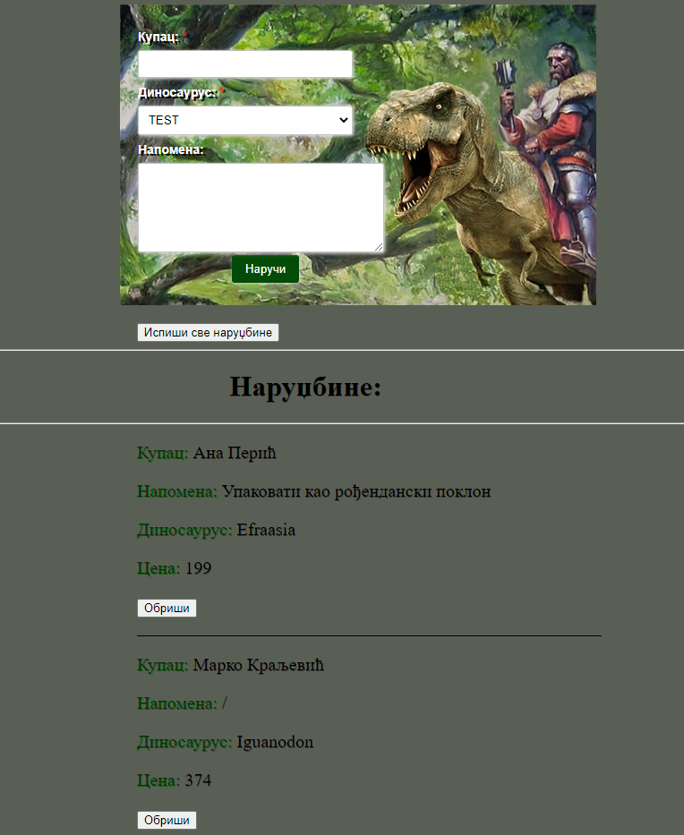

## (JS8) Други тест - JS DOM

Написати апликацију за наручивање фосилних јаја диносауруса,

Задаци (и функционалности):

1. У select (видети HTML) убацити све могуће опције за куповину (низ се налази у index.js)
    - Ако ово не знате да урадите помоћу низа, опције додати ручно (прве 4 опције, да не одузима превише времена)  (Ово носи 50% поена)

2. Кликом на submit (дугме: 'Наручи') омогућити испис поруџбине и сачувати исту у низ, која садржи следеће информације:
    - Изабрани диносаурус
    - Купац
    - Напомена (ако је напомена празна, исписати "/", или сличну поруку)
    - Цена (налази се у низу)  - (Не задржавајте се око ставке 'Цена', радите остатак задатака)

3. Проверити уносе:
    - Уноси за диносауруса и купца не смеју бити празни (и не садрже само бланко знакове)
    - Унос за купца - дужина мора бити најмање 4 слова

4. Омогућити да се поруџбина обрише са странице (брисање из низа +5 поена, није обавезно)

5. Кликом на дугме Испиши све поруџбине, у конзоли исписати низ креиран у кораку 2

Изглед једног објекта:
```js
{
    id: 0,
    name: 'Scipionyx',
    img: 'http://images.dinosaurpictures.org/Scipionyx_QY_200_3742.jpg',
    cena: 221
}
```

----------------------



